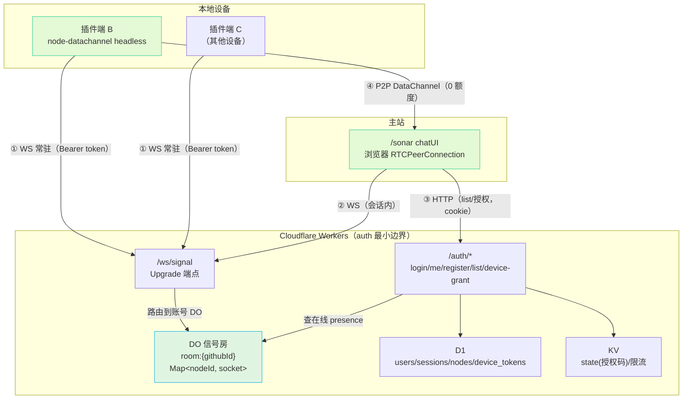
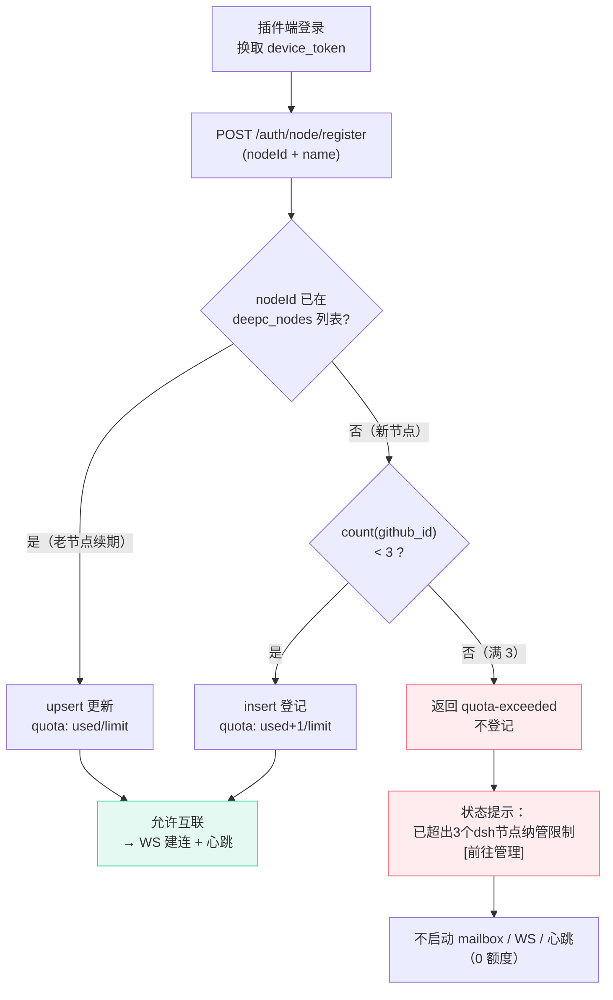

# deepc-bridge 多端设备 + 信令架构方案

> 状态：**方案定稿 · 实现中** · 关联 `deepsea-deepc-bridge-plan.md`（总体方案）
> 编写：2026-08-21 · 本文档承载「多端设备管理 / 信令管理 / 存储 / 安全 / D1 设备注册」
> 的**唯一方案底稿**，是 deepc-bridge 从「临时口令单连接」升级到「账号内多端长期
> 互联」的架构依据。
> **信令传输层（2026-08-21 定稿）**：从「KV 轮询」升级为「WebSocket + Durable
> Objects 推送」（方案 A），消灭设备侧轮询浪费，详见 §11。
>
> ⚠️ **现状（2026-08-22）**：临时连接（connectId 临时口令）已在 PDCA-G3 **移除**，
> 唯一链路 = **账号内多端直连（WS+DO）**。下文 §2.1/§2.3/§3.1/§6.3/§8 的临时口令 /
> connectId 描述为历史演进记录，**勿据此实现新代码**；唯一权威见 `plan.md` §0 与 §3.4。

---

## 1. 目标与定位

deepc-bridge 的连接从「临时口令单次连接」升级为**两条互补链路**：

| 链路 | 授权凭证 | 生命周期 | 用途 |
|------|---------|---------|------|
| ~~临时互联~~（已移除，PDCA-G3） | ~~connectId~~ | ~~单次 60s~~ | ~~跨账号 / 未登录的临时授权~~ |
| **多端直连**（唯一链路） | GitHub 登录态 + 设备注册 | 长期，自动连接 | 自己的多设备无感互连 |

**产品形态**（对齐 SSH 多端管理心智）：

- **插件端（本地 dsh）**：右上角 deepSea 图标悬浮球 → 点击向左扩展出卡片式 Sheet；
  header 左侧 `(deepc logo) deepSea`、右侧登录按钮（登录后显示头像）；body 为
  「临时互联」开关（开启生成一次性 connectId/uuid，60s 失效 + 信令失效）。
- **deepc 主站 `/sonar`**：顶部 `[link code] 连接` 输入框 + 弹框输 connectId；下方以
  卡片列出已登录的设备 node 端，点卡片即可连接；临时连接成功后提示「保存节点 +
  授权登录」。

---

## 2. 信令管理：账号内信箱式信令（WS + Durable Objects 推送）

WebRTC 信令的本质是「两端交换加密 SDP」。deepc-bridge 唯一的寻址方式是**账号内信箱式
信令**：连接方随时发起，目标设备**被动接收推送**即可接入（无轮询、无人工传码）。

```
寻址   = nodeId（插件后端 hostname 派生，同主机 = 同 ID，仅账号持有者经 /auth/node/list 可见）
signalKey = 收件人 nodeId 派生（deriveNodeSignalKey，AES-GCM 加密 SDP）
传输   = WebSocket（插件端常驻长连接 ↔ Durable Objects 信号房，无轮询）
```

- **寻址**：`nodeId` = 插件后端（node 端）由主机 `hostname` SHA-256 派生 UUID v4
  （同主机 = 同 ID；主站 console 端另用 GitHub 账号派生），不可枚举；只有账号持有者经
  `/auth/node/list` 可见。
- **投递**：主站发起方 → 经 `/ws/signal`（DO 信号房）→ DO **推**给目标 node 端 →
  node 端经同一 WS **回投**加密 answer → DO 推回主站侧。**全程 WS 推送，无轮询**。
- **存储**：DO 内存持有 `nodeId → WebSocket` 映射（Hibernation 空闲不收费）；设备元数据、
  在线状态仍落 D1（关系型，见 §4）；信令密文仅在传输窗口内存中，不落持久层。
- **适用**：同账号设备长期自动连接（无轮询、无人工传码）。

> 详细设计（DO class / Hibernation / 认证 / 加密 / 费用）见 §11。

### 2.4 前后端 token 传递（连接层在 node 端）

WS 信令 `/ws/signal?token=xxx` 与设备注册 `/auth/node/*`（`Authorization: Bearer`）都需
`device_token`。由于**连接层在插件后端（node 端）**，token 由后端持有。

**传递链路（文字描述）**：

1. **插件前端**（`host-ui.ts`，纯展示）点「登录」→ 经 `/deepc/login` 调**插件后端**
   （`node-host.ts`），后端生成 state 并返回主站授权 URL。
2. **插件前端**打开授权确认页（`/device-login?state=xxx`），用户在主站确认授权。
3. **插件后端**（`node-host.ts`）轮询 `POST /auth/device-grant/poll`（一次性消费）换取
   `device_token`，token 直接落后端内存（`NodeTokenStore`），**不经前端、不落 localStorage**。
4. **插件后端**自持 token，据此完成：设备注册（`/auth/node/register`）、
   WS 信令（`/ws/signal?token=xxx`）、配置同步（`/auth/config/*`）。
   （在线状态由 WS 长连接 presence 体现，**不再发 HTTP 心跳**。）

**token 落地**：后端自持（内存），不落前端 localStorage 之外的明文、不落盘。

- **为何不用官方 `/api`**：dsh 的 `/api` 通道被官方 gateway 独占，`RpcMethodMap` 编译期
  封闭，插件无法注入自定义 method（`/api/deepc.*` 会 404）。用**隔离前缀 `/deepc`**
  （`ctx.webServer.register` 前缀路由）作为后端专用通道，避开冲突。
- **前端职责收窄**：前端只负责打开授权确认页、展示登录态/开关/同步结果；登录、注册、
  心跳、信令、`deepc.*` 能力全部在 node 后端执行。

---

## 3. 安全模型

### 3.1 长期连接安全

| 威胁 | 缓解 |
|------|------|
| nodeId 被枚举/猜测 | nodeId 为 hostname 派生 UUID（SHA-256 → UUID v4），不可遍历；仅登录账号可查询 |
| 信箱被投毒（跨账号投递） | 信箱信令端点校验登录态 + `github_id` 归属，非本账号设备不可投递 |
| SDP 明文泄露 | 设备配对密钥（每设备独立）派生的 AES-GCM 加密，Worker 只存密文 |
| 设备丢失/被盗 | 设备可删除（吊销），删除后信箱失效 + 连接断开 |
| 心跳伪造 | 心跳端点校验登录态 + `node_id` 归属，非持有者不可续期 |

### 3.3 设备配对密钥

- 设备注册时生成随机 `device_secret`（仅存本地，不上传），用于派生该设备的信箱
  roomId + SDP 加密密钥。
- **Worker 永不接触 device_secret**：信箱键 = `HKDF(nodeId + device_secret)`，
  Worker 只按 nodeId 存 KV，不知道 roomId 派生用的 secret → 即使 Worker 被攻破，
  也拿不到解密 SDP 的密钥。

> 简化落地（v1）：`device_secret` 先退化为「nodeId 本身作为 HKDF IKM」，信箱键 =
> `HKDF(node:${nodeId})`。因为 nodeId 是登录态下私有的，安全边界足够；后续再加
> 独立 secret 增强。

---

## 4. D1 设备注册（长期自动连接的数据底座）

### 4.1 `deepc_nodes` 表

```sql
CREATE TABLE IF NOT EXISTS deepc_nodes (
  node_id    TEXT PRIMARY KEY,        -- 插件后端 hostname SHA-256 派生（同主机 = 同 ID）
  github_id  INTEGER NOT NULL,        -- 归属账号（登录态绑定）
  name       TEXT NOT NULL,           -- 本端名称（hostname，用户可改）
  last_seen  INTEGER,                 -- 最后在线时间戳（注册/WS 建连时写，仅作「最后活跃」展示）
  created_at INTEGER NOT NULL,
  updated_at INTEGER NOT NULL
);
CREATE INDEX IF NOT EXISTS idx_nodes_github ON deepc_nodes(github_id);
```

- **在线判定**：`online` = DO 内存态（`nodeId → socket` 存活）——权威源，0 额度；
  `last_seen` 仅作「最后活跃时间」展示，不驱动 online（不再发 HTTP 心跳）。
- **生命周期**：注册（upsert）→ 删除（吊销）。

### 4.2 端点（全部需登录态）

| 路由 | 方法 | 说明 |
|------|------|------|
| `/auth/node/register` | POST | upsert 设备（nodeId + name）+ **配额校验**（新增受限，更新/续期不受限，见 §4.4） |
| `/auth/node/list` | GET | 列出同账号设备（online = DO presence 查询，见 §12.5） |
| `/auth/node/remove` | POST | 删除设备（吊销，下线，释放配额） |
| `/ws/signal` | WS | 插件端/主站信令长连接（Upgrade；DO 信号房，见 §11） |

### 4.3 归属校验（安全核心）

所有 node 端点先 `resolveActorUserId`（cookie → D1 会话 → github_id，**回退** Bearer
device_token 插件端），再以 `github_id` 过滤 node 行。**连接方只能操作自己账号下的设备**，
这是「多端直连不越权」的根保证。

### 4.4 节点配额限制（防单用户资源滥用）

**每个 GitHub 账号名下最多登记 3 个 dsh 节点**，超限拒绝新增（既有多端续期不受限）。

- **常量**：`MAX_NODES_PER_USER = 3`（worker 端强制，客户端不可绕过）。
- **校验位置**：`POST /auth/node/register` 原子完成「判断 + 登记」，**无需插件端先单独
  list 再 register**（省一次请求）：
  - 已存在（`getNode(nodeId, githubId)` 命中）→ 更新（续期/改名），**不受配额限制**；
  - 不存在（新节点）→ `countNodesByGithub(githubId) >= 3` → 返回 `quota-exceeded`。
- **D1 实现**：新增 `countNodesByGithub(env, githubId)`（`SELECT COUNT(*) WHERE github_id=?`）；
  `upsertNode` 前置判断。
- **返回**：
  - 成功 `{ ok: true, quota: { used, limit } }`
  - 超限 `{ ok: false, error: "quota-exceeded", quota: { used, limit } }`（HTTP 200，非 4xx，
    便于插件端区分「业务配额」与「鉴权失败」）
- **释放配额**：`POST /auth/node/remove` 删除节点即释放名额。

---

## 5. 连接时序（多端直连 · 方案 A：WS 推送）

```
插件端 B（已登录）                          主站 /sonar（已登录，同账号）
─────────────                              ─────────────
① 配额自查 + 登记：POST /auth/node/register  GET /auth/node/list → 看到 B 卡片
   ├─ 在列表内（老节点）→ 续期成功 → 继续
   └─ 不在列表 + 已满 3 → quota-exceeded
      → 停止登记（状态提示，见 §12.8）
② 建立 WS 长连接 /ws/signal（带 device_token）
   → DO 信号房登记 {nodeId → socket}（Hibernation）
③ 常驻监听 WS 推送（不再轮询）
                                           ④ 点 B 卡片 → 经 /ws/signal 发 offer
                                              （加密 offer，target=B）
                                           ⑤ DO 信号房经 WS 推送 offer 给 B
⑥ 收到 offer 推送 → 解密 → createAnswer
   → 经 WS 回投加密 answer
                                           ⑦ DO 经 WS 推 answer 回主站
                                           ⑧ setRemoteDescription → DC open → ping/pong
```

- **无轮询**：B 端常驻 WS 长连接被动接收；主站侧经同一 WS 接收 answer。
- **配额前置**：① 步先完成「是否在列表内 + 配额」判断，超限则不建 WS/不启动心跳（0 额度）。
- **自动连接**：主站看到 B 在线即可随时发起；B 端无感接入。
- **断连自愈**：WS 意外断开走指数退避重连（1s→2s→…→30s 封顶），**不回退轮询**。

---

## 6. 主动登录与设备授权（token 传递）

### 6.1 问题

deepc 主站登录态是 `ds_session` cookie（HttpOnly + Secure + SameSite=Lax，domain
绑定 deepc.cn），而插件端跑在 `http://127.0.0.1:3080`（本地 dsh 前端），**浏览器
不会把 deepc.cn 的 cookie 带到 127.0.0.1:3080**，插件端拿不到登录态。因此插件端
需要**独立的设备凭证**（device_token），并经一条安全通路取得。

### 6.2 设备授权码流（Device Grant，主方案）

无需预先建连，插件端即可换取长期设备凭证：

```
插件后端（node-host，Node 进程）          deepc 主站（deepc.cn）
─────────────                          ─────────────
① 前端点「登录」→ 经 /deepc/login 调      ② 前端打开 /device-login?state=xxx
   后端生成 state（uuid），返回授权 URL     · 未登录 → GitHub OAuth → 回跳该页
                                          · 已登录 → 展示「确认授权此设备」
③ 后端轮询 POST /auth/device-grant/poll   ④ 用户点确认 → POST /auth/device-grant
   { state }（每 2s）                      （cookie + state）→ Worker 签发
                                          device_token，KV 暂存（TTL 5min）
⑤ 后端换取 device_token（一次性消费）→
   落后端内存（NodeTokenStore，不落 localStorage）
⑥ 后端后续 register/heartbeat/signal 均带
   Authorization: Bearer device_token
```

- **device_token**：设备级长期凭证（默认 30 天，可配置），随机 256-bit，仅经授权码
  一次性换取；设备删除（吊销）时同步失效。
- **授权码 state**：插件后端生成的 uuid，作为换取凭证的「收件箱键」，一次性消费 +
  短 TTL，防重放/劫持。
- **CORS**：`device-grant/poll` 需允许 127.0.0.1:3080 等本地 origin（白名单）。

---

## 7. WebRTC 自动发现

WebRTC 本身**不做设备发现**——它需要先经信令交换 SDP 才能建连。因此「自动发现」
拆为三层，逐层收敛目标：

| 层级 | 机制 | 触发 | 结果 |
|------|------|------|------|
| **L1 本机探测** | 网页端 `fetch http://127.0.0.1:3080/api/host.describe` | /sonar 加载时 | 发现本机是否运行 dsh（本机节点） |
| **L2 账号设备发现** | `/ws/api-link` 节点快照帧（nodes-snapshot） | 登录后自动拉取 | 同账号所有在线设备（无需手工输入） |
| **L3 连接后能力发现** | DC open → hello 握手帧（host/session/theme/model） | 建连后自动 | 自动同步对端会话/主题/模型 |

- **L1**：本机 dsh host 在 127.0.0.1:3080 暴露 `host.describe`，网页端回环探测即可
  确认「本机有 dsh + 已装插件」，进而引导「本机即连」（走临时互联或绑定）。
- **L2**：已注册设备天然可枚举，是「多端直连」的自动发现底座；在线判定靠 DO 内存态
  （WS 存活）。
- **L3**：已由 `host-handshake.ts` 实现——DC open 即推 hello 帧，无需人工确认。

---

## 9. 落地顺序

1. **worker 端（信令传输层改造，方案 A）**：新增 Durable Objects 信号房 class +
   `/ws/signal` WebSocket 端点 + 归属校验（device_token/cookie）→ 见 §11。
2. **worker 端（既有）**：D1 `deepc_nodes` 表 + register/list/heartbeat/remove +
   设备授权端点（device-grant/poll）。
3. **插件端**：deepSea 悬浮球 → Sheet（header 登录/头像 + 配置同步）；接入设备
   授权流 + 注册；**接入 WS 信令长连接**。
4. **主站 `/links`**：SSH 风格设备卡片面板 + 点卡片直连（经 WS 信令）。
5. **贯通**：WS 信令全流程 + 设备授权 token 传递 + 自动发现。

---

## 10. 参考

- 总体方案：`docs/deepsea-deepc-bridge-plan.md`
- Auth/D1：`docs/deepsea-auth-migration-evaluation.md` · `apps/worker/src/lib/d1.ts`
- 浏览器端 client：`apps/web/src/lib/deepc-link/client.ts`
- 信令客户端（插件端）：`packages/deepc-link/src/node-signaling.ts`

---

## 11. 信令传输层改造：WebSocket + Durable Objects（方案 A）

> 目标：消灭设备侧「5s 轮询信箱」的浪费，改为**被动推送**。这是「Worker 最小边界」
> 内的最后一块——信令中转本属 auth 范畴（连接授权凭证交换），但传输方式从「轮询」
> 升级为「推送」，不再消耗 D1/KV 轮询读。

### 11.1 为什么必须 Durable Objects（而非裸 Workers WebSocket）

Workers 是无状态多实例（多 colo）。插件端 WS 连到 colo A、主站请求路由到 colo B，
B 拿不到 A 内存里的 socket。**Durable Objects 提供 single-point-of-coordination**——
同一账号的所有连接路由到同一 DO 实例，才能做 `nodeId → socket` 的跨连接推送。

### 11.2 DO 信号房设计

```
class SignalRoom（DurableObject）
  key   = `room:${githubId}`（按账号分区；同账号所有设备/主站连同一 DO）
  state = Map<nodeId, WebSocket>（Hibernatable WebSocket）

  方法：
    wsConnect(nodeId, socket)   —— 插件端/主站建连时登记（归属校验后）
    wsClose(nodeId)             —— 断连清理
    push(targetNodeId, payload) —— 向目标 nodeId 的 socket 推密文信令
```

- **分区键 = githubId**：同账号设备信号集中在单个 DO，天然隔离账号；个人场景 DO 数量 = 登录账号数（极少）。
- **Hibernation API**：`state.acceptWebSocket()` + `webSocketMessage()` 处理器，
  空闲时不占 CPU（duration 计费近 0）。

### 11.3 认证（安全核心）

WS 建连（Upgrade 请求）携带 `Authorization: Bearer device_token`（插件端）或
`ds_session` cookie（主站）。DO 建连前先 `resolveActorUserId` → 得到 githubId →
路由到 `room:${githubId}`。**非本账号的 nodeId 无法登记**，与既有 node 端点同源校验。

### 11.4 信令加密（不变）

WS 只透传密文。offer/answer 仍用 `deriveNodeSignalKey(targetNodeId)` 派生的 AES-GCM
密钥加密，DO 只见密文 SDP，不见明文。加密逻辑复用既有 `crypto.ts`，零改动。

### 11.5 费用（Free 计划内）

| 维度 | 消耗 | Free 额度 | 结论 |
|------|------|----------|------|
| WS 建连 request | 每设备 1 次/登录 | 100,000/天 | ✅ 忽略不计 |
| WS 入站消息 | 仅 offer/answer（低频，非高频心跳） | 100,000/天（20:1 折算） | ✅ |
| DO duration | Hibernation 空闲不收费；仅收发信令瞬间 | 13,000 GB-s/天 | ✅ 近 0 |
| DO 存储 | 仅内存 socket 映射（Hibernation 持久化极少） | 5GB | ✅ |

> 对比现状：5s 轮询 = 每设备 720 req/h → 现改为 WS 常驻 + 按需消息，请求量降 2~3 个数量级。

### 11.6 心跳与在线判定（纳入 WS，消灭 HTTP 心跳）

- **在线状态权威源**：从「D1 `last_seen` + HTTP 心跳」迁移到「DO 内存态 + WS 存活」。
  **WS 连接存活 = 在线**，不再单独发 HTTP 心跳。完整设计见 §12。
- **WS 断连 ≠ 立即离线**：插件端检测断连后自动重连；仅当重连超时（如 30s）才判定离线。
- 详见 §12「在线状态三级模型」。

### 11.8 安全结论（PeerJS 评估）

已评估 **PeerJS**（`peers/peerjs-server`）：其 broker 仅有服务器级共享 key、信令明文、
需独立 Node 进程部署、peer id 全局命名空间，无法表达「账号归属」且违背 Worker 唯一边界
——**不采用**。本方案用 CF Workers WS + DO **自建**同等推送能力，复用既有 AES-GCM 信令
加密 + 账号归属校验，安全边界与既有 node 端点一致。

---

## 12. 全链路最小额度设计（整个互联功能）

> 目标：不止信令，而是把「探查 / 授权 / 注册 / 在线保持 / 连接建立 / 数据面」六个
> 环节全部以**最小 Worker 额度**重新设计。核心原则：
> **「能走 P2P 的绝不走 Worker；能走 WS 消息的绝不发 HTTP 请求；能一次性/按需的绝不轮询。」**

### 12.1 额度全景对比（每设备）

| 环节 | 现状（轮询 + HTTP 心跳） | 目标（WS 常驻 + 全 WS 信令） | 降幅 |
|------|------------------------|---------------------------|------|
| 信令传递 signal/get | 5s 轮询 = **17,280 req/天** | WS 推送消息 = **0 HTTP** | ∞ |
| 在线心跳 heartbeat | 30s = **2,880 req/天** | WS ping/pong = **0 HTTP** | ∞ |
| 注册 register | 登录时 1 req | 登录时 1 req（或并入 WS 首帧） | — |
| WS 建连 | 无 | 登录后 1 req（常驻） | +1 |
| 设备发现 list | 进入页面 1 req | 进入页面 1 req | — |
| **稳态合计** | **≈ 20,000 req/天/设备** | **≈ 2 req/天/设备** | **≈ 4 个数量级** |

> 20,000 → 2，即 **10,000 倍**。多设备场景下，Worker Free 额度（10 万 req/天）从「约 5 台
> 设备就耗尽」变为「几百台设备也绰绰有余」。

### 12.2 六大环节的生命周期与额度归属

| # | 环节 | 触发 | 通道 | Worker 额度 | 频次 |
|---|------|------|------|------------|------|
| ① | 探查（Discovery） | 主站加载 /sonar | L1 回环 + L2 list | L1=0（回环不进 Worker）；L2=1 req | 按需 |
| ② | 授权（Device Grant） | 插件端登录 | HTTP | ~5 req（一次性） | 仅登录 |
| ③ | 注册 + 建连 | 登录后 | HTTP + WS | register 1（含配额校验）+ WS 1 | 仅登录 |
| ④ | 在线保持（Presence） | 持续 | **WS 长连接** | **0 HTTP**（ping/pong 免费） | 常驻 |
| ⑤ | 连接建立（Signal） | 点卡片 | **WS 消息** | **0 HTTP** | 按需 |
| ⑥ | 数据面（Data plane） | 连接后 | **P2P DataChannel** | **0（不经 Worker）** | 连接期 |

### 12.3 全链路时序图

```mermaid
sequenceDiagram
    autonumber
    participant Dev as 插件端（设备 B）
    participant DO as DO 信号房<br/>room:{githubId}
    participant Site as 主站 /sonar
    participant D1 as D1（静态元数据）

    Note over Dev,Site: ① 探查：主站进入页面（1 req）
    Site->>D1: GET /auth/node/list（cookie）
    D1-->>Site: 设备列表（元数据 + 在线态）

    Note over Dev,Site: ② 授权：插件端登录（一次性 ~5 req）
    Dev->>Site: 打开 /device-login?state（Device Grant）
    Site->>D1: POST /auth/device-grant（cookie）
    Dev->>Site: poll /auth/device-grant/poll → device_token

    Note over Dev,DO: ③ 注册 + 建连（登录后，各 1 req）
    Dev->>D1: POST /auth/node/register（Bearer device_token）
    Dev->>DO: WS Upgrade /ws/signal（Bearer device_token）
    DO-->>Dev: 登记 nodeId → socket（online）

    Note over Dev,DO: ④ 在线保持（0 HTTP req）
    loop WS 协议层 ping/pong
        Dev-->>DO: 心跳（免费，非应用消息）
    end

    Note over Site,DO: ⑤ 连接建立（全 WS，0 HTTP req）
    Site->>DO: WS push offer（加密，target=B）
    DO->>Dev: 推送 offer（WS 消息）
    Dev->>DO: WS 回投 answer（加密）
    DO->>Site: 推送 answer（WS 消息）

    Note over Dev,Site: ⑥ 数据面（P2P，0 worker 额度）
    Dev<-->Site: DataChannel 直连（DTLS + 应用层 AES-GCM）
```

### 12.4 网络拓扑图



### 12.5 在线状态三级模型（关键决策）

「谁判定设备在线」是额度优化的**核心矛盾**——现状用 HTTP 心跳写 D1 是最大的非信令浪费。
新模型分三级，逐级降额：

| 层级 | 判据 | 额度 | 时效 | 用途 |
|------|------|------|------|------|
| **L0 内存态**（主） | DO 内 `nodeId → socket` 存活 | 0 | 实时 | 在线判定第一来源 |
| **L1 持久兜底**（次） | D1 `last_seen`（**仅 WS 断连时写一次**） | 极少 | 分钟级 | 设备离线后仍可查「最后在线时间」 |
| **L2 静态元数据** | D1 `deepc_nodes` 注册行 | 0 | 永久 | nodeId/name/created |

- **主站 list**：读 D1 静态元数据 → 调 DO `/presence` 拿在线 nodeId 集合 → 合并返回
  「元数据 + online」。DO 无该账号活跃实例时返回空集（该账号所有设备均离线）。
- **HTTP 心跳端点 `/auth/node/heartbeat` 处置**：**已删除**（2026-08-22）。在线判定
  纯靠 WS presence，插件端与主站 console 均不再发 30s 心跳。

### 12.6 降级与兜底（可用性优先）

| 异常 | 降级路径 | 代价 |
|------|---------|------|
| WS 建连失败 | 指数退避重连（不回退轮询） | 短暂延迟 |
| DO 实例被 evict | 插件端重连，DO 重建 socket 映射 | 短暂断连 |
| WS 断连 | 指数退避重连（1s→2s→…→30s 封顶） | 信令延迟 |
| 主站查在线失败 | DO 无实例返回空集（均视为离线） | 瞬时误判（重连即恢复） |

### 12.7 关键权衡点（已全部拍板落地）

1. **✅ 心跳完全走 WS**（2026-08-21）：
   - 在线状态权威源 = DO 内存态（socket 存活 = online），0 额度。
   - 兜底：WS 断连时写一次 D1 `last_seen`（L1），不再常驻 HTTP 心跳。
   - 配合配额约束（§4.4）：单用户最多 3 节点，WS 常驻连接数有界，无滥用风险。
2. **✅ register 独立于 WS 首帧**（已落地）：
   - 独立 HTTP `POST /auth/node/register`（清晰优先 + 配额校验在 register 原子返回，
     1 req 差异可忽略）。
3. **✅ 主站按需 WS**（已落地）：
   - 主站仅在「点卡片连接」窗口内建 WS（`connectToNode` 内 `createWsSignalClient`），
     DC open 后即断开，无需常驻，进一步省连接。

### 12.8 节点配额与插件端自查（防滥用）

**每个账号最多 3 个 dsh 节点**（§4.4），插件端登录后**原子自查 + 登记**，超限即停止
后续信令/心跳/WS 建连，避免浪费额度：



- **自查语义**：`register` 的 upsert + 配额校验原子完成，插件端无需先 `list` 再 `register`
  （省一次请求）。「是否在列表内」由 `getNode(nodeId, githubId)` 命中与否判定。
- **超限行为**：`quota-exceeded` → 插件端**不启动** mailbox host / WS 信令 / 心跳，状态栏
  提示 `已超出3个dsh节点纳管限制 [前往管理]`；「前往管理」跳主站设备管理页（/sonar）。
- **释放名额**：主站设备卡片提供「移除」→ `POST /auth/node/remove` → 名额释放，插件端
  下次登录可重新登记。
- **多端一致性**：配额以 D1 `deepc_nodes` 实际行数为准（权威），不依赖 DO 内存态。
