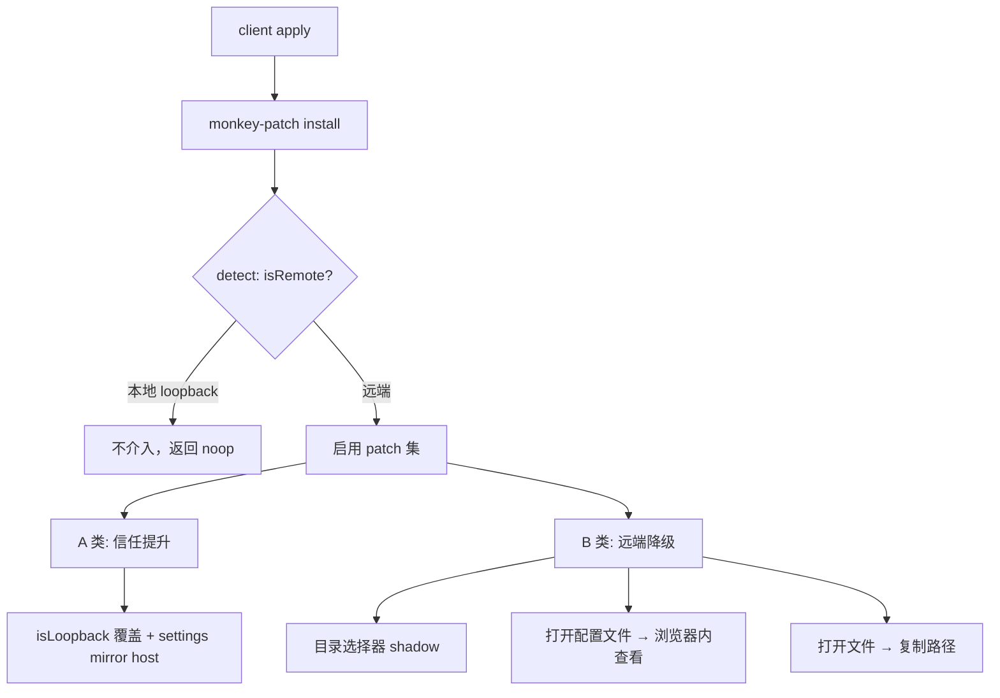

# deepc-link 远端能力接管（Monkey-Patch）方案文档

> 目标：把「无法从插件层干净实现、需要覆盖 dsh 原有行为」的能力，统一收敛到一个
> `monkey-patch.js` 介入层里，逐项评估、设计并落地方案；同时把通用改动抽象成
> 可提交 dsh 官方的 patch，降低后续版本升级时的维护成本。

---

## 1. 背景与目标

deepc-link 通过 **3081 鉴权代理（TOTP 2FA）+ cloudflared 隧道** 把本地 dsh 暴露到
远端浏览器。dsh 内部有一批能力是 **loopback-only**（仅限本机访问）：

- **客户端判定**：`dsh-client-connection` 的 `connection.isLoopback` 基于
  `window.location.hostname` 判定，远端（trycloudflare / 局域网 IP）恒为 `false`。
- **服务端判定**：`dsh-client-connection` 的 `PRIVILEGED_METHODS` 集合（见下表），
  经 `isTrustedApiRequest(request, [])` 校验 Host 必须 loopback + Origin 同源。

deepc-link 的 3081 反代（`changeOrigin: true` 让 Host 改写为 `127.0.0.1` + 剥离 Origin）
恰好让这些特权 RPC **在服务端全部通过**（实测 `settings.describe`/`settings.update`
经 3081 均 200）。因此远端访问时，故障点**全部在客户端**：dsh 前端凭 `isLoopback=false`
主动关掉了这些能力的入口。

已通过 3081 实际访问验证的三个设置项故障，均源自此（详见仓库记忆
`deepc-settings-remote-loopback-fix.md`）。

### 核心结论

- **A 类「纯数据能力」**（`settings.describe`、`agentPreset.list` 等）：数据经 RPC 回传、
  远端可见 → **只需解除 `isLoopback` 限制即可恢复**。
- **B 类「宿主机副作用能力」**（`host.openPath`、`settings.openDocument`、
  `host.pickDirectory` 等）：动作在**宿主机**执行（PowerShell `Invoke-Item` / `open` /
  `xdg-open` / OS 对话框），远端浏览器**看不到结果** → 不能只解除限制，必须**替换为
  远端等价能力**（浏览器内查看内容 / 复制路径 / 浏览器内目录浏览）。

Monkey-Patch 层的职责，就是对 B 类能力做「远端降级」，对 A 类能力做「鉴权信任提升」，
并把二者统一封装。

---

## 竞品调研（GitHub，2026-08-26）

调研对象：GitHub 上已有的 dsh 远程互联方案（`dsh-remote`、`dsh-full-remote`、
`dsh-bridge`、`dsh-pocket` 等），取其精华。结论如下。

### 竞品速览

| 方案 | star | 核心做法 | 对我们的价值 |
| --- | --- | --- | --- |
| `shaobeichen/dsh-pocket` | 675 | 手机扫码同步访问（局域网 + 公网实时同屏） | 产品形态参考 |
| `summer1238/dsh-remote-web-gateway` | 146 | 扫码配对 + GitHub 授权加密登录 + 独立设备授权与撤销 | 设备授权模型 |
| `xgone/dsh-remote` | 47 | TOTP + 会话 cookie + 角色门控 + 浏览器内目录 picker + 远端文件侧边栏 | **最贴近，可直接借鉴** |
| `wenbin-wb/dsh-bridge` | 49 | 多通道隧道 + 全协议认证 + 后台防篡改 | 隧道管理 |
| `JUANWANG-BUAA/dsh-full-remote` | 24 | Host/Origin 改写 + 设备会话 + index-tap 提前 pin `isLoopback` | **isLoopback pin 解法** |
| `Yari-tuber/dsh-remote-gateway` | 10 | managed Cloudflare Quick Tunnel | 隧道一键化 |

### 关键精华（直接命中我们的遗留难题）

1. **目录选择器：用官方 browse 后端，而非自建 slot shadow**
   `xgone` 用 `cordis.patch.yml` **禁用 `directory-picker-auto`**（loopback 下它解析成 native、
   弹宿主机窗口），再 insert 官方 `dsh-host-directory-picker-browse` + `dsh-client-ui-directory-picker-browse`：
   ```yaml
   - id: directory-picker        # 禁用 auto 选择器
     disabled: true
   - insert:
       - id: directory-picker-browse      # browse 宿主后端
         name: '@deepseek-ai/dsh-host-directory-picker-browse'
       - id: directory-picker-browse-ui   # 浏览器端目录对话框
         name: '@deepseek-ai/dsh-client-ui-directory-picker-browse'
   ```
   比我们自建 `directory-picker.ts` + `priority:-1` shadow 更正统、零维护。**长期应切到这条路径**。

2. **插件配置卡片字段空（我们的遗留难题）有两条成熟解法**
   - `xgone` `unpinRemoteSettingsScopes()`：monkey-patch `SettingsScopeController.prototype.enqueue`
     （去掉 memory 模式的读写早退 `if (persistence === "memory") return`），再触发一次
     settings 广播让已绑定的 scope 重新 load。
   - `dsh-full-remote` index-tap：注入 IIFE wrap `__ModuleLoader__.create`，在官方 connection
     插件 apply 之后**立即 pin `connection.isLoopback = true`**，早于所有 settings 消费者 bind。
     关键坑：`create()` 会把 `target.load` 赋成 data property 覆盖一次性的 wrap，需用 accessor trap
     并在 `create()` 之后重新 trap。

3. **打开文件：浏览器内预览，而非仅复制路径**
   `xgone` 拦截远端 `host.openPath` RPC，改为 `/auth/file` 右侧边栏预览（markdown 渲染、图片/PDF/
   视频 inline、文本代码等宽预览、目录逐层导航），参考 Claude Desktop 交互。比我们 P2 的「复制路径」
   体验更好，**升级方向明确**。

4. **服务端 Host/Origin 归一化（normalizeForFence / trustProxy）**
   两方案都在**插件 node 端**把认证后请求的 `Host`/`Origin` 归一化为 `127.0.0.1:<port>` 再过 fence，
   而非依赖独立反代。`dsh-full-remote` 特别强调：**改写必须恒用 `127.0.0.1` 字面量，与 `backendHost`
   解耦**（`0.0.0.0` 会让远程全线 403，已实测踩坑）。

5. **角色级方法门控**
   `xgone` 提供 `NON_ADMIN_DENY`（settings/credentials/agentPreset 平面）+ `GUEST_DENY`（写操作）
   两级方法门控，比我们仅 TOTP 更细粒度。

6. **运行时自检 `probeFence`**
   `dsh-full-remote` 提供 `settings.describe` 探针，主动验证特权栅栏是否被 Host 改写打通，用于诊断。

### 采纳计划

- ✅ **P0（本次落地）**：`monkey-patch.ts` 统一层（patch 注册表 + 幂等 + 逐项降级），
  现有 `settings-mirror` 与 `directory-picker` 两个 patch 迁入。
- **P1 打开配置文件** → 参考 `xgone` `/auth/file` 侧边栏（浏览器内查看，而非宿主机打开）。
- **P2 打开文件** → 参考 `xgone` 浏览器内预览（升级原「复制路径」方案）。
- **P4 插件配置卡片** → 参考 `xgone` enqueue unpin + `dsh-full-remote` index-tap pin（二选一或组合）。
- **目录选择器长期** → 切官方 browse（`cordis.patch.yml`），降维护成本。

---

## 2. 现状盘点

### 2.1 已完成的 Monkey-Patch（分散，待统一）

| 能力 | 现有实现 | 位置 | 状态 |
| --- | --- | --- | --- |
| 目录选择器 | `priority: -1` shadow 官方 native picker，注册浏览器内目录浏览 UI，走 `/deepc/list-dir` + `/deepc/create-dir` | `src/client/directory-picker.ts` | ✅ 已生效 |
| settings 共享 mirror | `connection.isLoopback = true` + 把 mirror 从 `memory` 切回 `host` 并重新拉取 | `src/client/index.ts` 的 `restoreRemoteSettings` | ✅ 已生效（模型 / Agent 预设恢复） |

### 2.2 dsh 特权方法全集（`PRIVILEGED_METHODS`）

| 方法 | 类别 | 远端经 3081 | 客户端判定点 | 现状 |
| --- | --- | --- | --- | --- |
| `settings.describe` | A 数据 | 200 | mirror `memory` | ✅ 已 patch |
| `settings.update/replace/mutate` | A 数据 | 200 | scope `memory` | ⚠️ 部分（模型/预设可用；插件卡片表单字段仍空，见 §6） |
| `credentials.describe/set/unset` | A 数据 | 200 | — | 待评估 |
| `llm.discoverModels` | A 数据 | 200 | — | 待评估 |
| `agentPreset.read/copy/remove` | A 数据 | 200 | — | 待评估 |
| `agentPreset.openDocument` | B 副作用 | 200（宿主机打开） | preset 管理页 | ❌ 待 patch |
| `settings.openDocument` | B 副作用 | 200（宿主机打开） | `documentController = isLoopback ? ... : void 0` | ❌ 待 patch |
| `host.openPath` | B 副作用 | 200（宿主机打开） | `canOpenPath = isLoopback && hostCanOpenPath` | ❌ 待 patch |
| `host.pickDirectory` | B 副作用 | —（native capability） | native flow slot | ✅ 已 patch |

---

## 3. Monkey-Patch 统一架构设计

### 3.1 单一入口 `monkey-patch.js`

将 `directory-picker.ts` 与 `restoreRemoteSettings` 的职责收敛，新增统一入口文件：

```
packages/deepc-link/src/client/
├── index.ts            # client 端 apply 入口：调用 monkey-patch.js 的 install()
├── monkey-patch.ts     # 统一介入层（本方案新增）
│   ├── detect.ts       # 环境判定：isRemote() / isLoopbackHost()
│   ├── patches/
│   │   ├── directory-picker.ts   # B 类：目录选择器（迁移自现有 directory-picker.ts）
│   │   ├── open-document.ts      # B 类：打开配置文件（settings.openDocument）
│   │   ├── open-path.ts          # B 类：打开文件/路径（host.openPath）
│   │   └── settings-mirror.ts    # A 类：settings mirror + isLoopback 信任提升
│   └── index.ts        # install(ctx) / 幂等守卫 / 卸载
├── directory-picker.ts # （保留旧路径，转由 monkey-patch.ts re-export，过渡期兼容）
└── host-ui.ts
```

### 3.2 分层原则



### 3.3 幂等与卸载

- `install(ctx)` 用 `hostUiInjected()` 同款守卫，避免重复介入。
- 每个 patch 通过 `ctx.effect(() => ...disposer)` 注册，随 fiber 卸载自动清理
  （与现有 `registerBrowseDirectoryPicker` 一致）。

---

## 4. 逐能力评估与设计

### 4.1 目录选择器（B 类，已解决 → 迁移）

**现状**：官方 `dsh-client-ui-directory-picker-native` 用默认 `priority: 0` 注册到
`conversation.hero.workspace.directoryFlow` / `sidebar.workspaces.directoryFlow` 两个
single-kind slot，`pick` 走 `ctx.workspaces.pickDirectory()` → `host.pickDirectory` →
宿主机 OS 对话框。

**已落地方案**：`priority: -1` 成为 single slot winner，注册浏览器内目录浏览组件，
`listDirectory/createDirectory` 走 `/deepc/list-dir` + `/deepc/create-dir`（`host.ts`
已把这些端点放在 `remote` 拒绝判断之前，远端经 2FA 后可用）。

**迁移动作**：把 `registerBrowseDirectoryPicker` 迁入 `monkey-patch.ts`，`client/index.ts`
只保留一行 `installMonkeyPatches(ctx)`。行为不变，仅组织调整。

> 历史教训（`docs/deepsea-deepc-directory-picker-slot-conflict.md`）：同 priority 硬撞会
> 导致官方 native 插件 apply 失败（"single slot already has a registration"）。**必须
> 用更低 priority shadow**，不能用同 priority 重注册。

### 4.2 打开配置文件 `settings.openDocument`（B 类，待 patch）

**现状**：
- 客户端 `dsh-client-ui-settings-general`：`documentController = connection.isLoopback
  ? new SettingsDocumentStore(...) : void 0` —— 远端按钮**直接不渲染**。
- host 侧 `settings.openDocument` → `settings.prepareDocument()` 拿到文档路径 →
  `openNativePath`（宿主机 `Invoke-Item` / `open` / `xdg-open`）拉起本地编辑器。

**远端语义目标**：远端用户点「打开配置文件」，应**在浏览器内看到文档内容**（而非在
宿主机弹一个远端看不到的编辑器窗口）。

**Patch 方案**：
1. **服务端**：`host.ts` 的 `handleControl` 新增只读端点 `GET /deepc/read-doc`，放在
   `remote` 拒绝判断之前（与 `list-dir` 同策略），返回 settings 文档内容。
   - 数据源：复用 `settings.documentPath`（dsh settings provider 已暴露），或约定
     只读 `~/.dsh/settings.yaml`（与 dsh `settings-file` 的持久化路径一致）。
   - 安全：只读、路径白名单（仅 settings 文档 / preset 目录下的 `*.md` 等），禁止任意
     文件读取；远端已过 dc_site 2FA 校验。
2. **客户端**：monkey-patch 在远端时注册一个 `settings.header` / 对应 slot 的「打开配置
   文件」动作，点击后 fetch `/deepc/read-doc`，弹出浏览器内只读查看器（复用
   directory-picker 的 Dialog 样式体系，新增一个只读 code view）。
   - 不调 `api.settings.openDocument`（避免在宿主机静默打开）。

**备选（更保守）**：远端时把按钮 label 改为「复制配置路径」，点击复制
`settings.documentPath` 到剪贴板。实现最简，但体验弱于浏览器内查看。

### 4.3 打开文件/路径 `host.openPath`（B 类，待 patch）

**现状**：`dsh-client-ui-deliverables` 的 `ProducedFiles` 组件
`canOpenPath = isLoopback && hostCanOpenPath` —— 远端交付物文件的「打开」按钮不渲染。

**远端语义目标**：远端用户点「打开」，**复制宿主机文件路径**（提示已复制），因为远端
浏览器无法真正打开宿主机文件。

**Patch 方案**：
1. **客户端**：monkey-patch 远端时把 `connection.isLoopback` 覆盖为 `true`（§4.5 已做），
   使 `canOpenPath` 恢复；同时**替换 `openFile` 行为**——原 `openFile` 走
   `api.host.openPath`（宿主机打开），替换为「复制路径 + toast 提示」。
   - 替换点：`deliverables` 的 `openFile` 通过 slot `inject` 传入，可通过再注册一个
     更低 priority 的 slot 组件覆盖，或通过 `ctx` 服务层拦截 `workspaces.openPath`。
2. **服务端**：无需改动（`host.openPath` 保持 loopback 特权，但远端已过 2FA，反代后
   200；我们只是不在客户端调用它，改走复制路径）。

**风险**：`openPath` 在远端「复制路径」会让用户以为能打开，需明确文案（如「已复制路径
`C:\...\file`（宿主机文件，远端无法直接打开）」）。

### 4.4 Agent 预设 `openDocument`（B 类，待 patch）

**现状**：`dsh-client-ui-agent-preset` 的「查看」按钮在 preset 管理页走
`agentPreset.openDocument`，远端在宿主机打开 preset 目录。

**远端语义目标**：与「查看」一致——远端应看到 preset 的**内容**（`agentPreset.read`
已能返回内容）。

**Patch 方案**：
- 复用 `agentPreset.read`（A 类，反代后 200），远端时把「查看」按钮从「宿主机打开目录」
  替换为「浏览器内展示 preset 内容」（`agentPreset.read` 返回的 `content`）。
- 服务端无需新增端点。

### 4.5 settings mirror + `isLoopback` 信任提升（A 类，已解决）

**现状**：`restoreRemoteSettings` 已做两件事：`connection.isLoopback = true` + 把
settings mirror 从 `memory` 切回 `host` 并 `load()`。

**收敛动作**：迁入 `monkey-patch.ts/patches/settings-mirror.ts`。保留现有语义，仅移动。

**遗留（需在本方案中决策）**：插件配置 tab 能枚举出 3 个插件 namespace，但卡片表单字段
仍空 —— 根因是 `settings-plugins` 在它自己 apply 时用 `isLoopback=false` 创建了 memory 的
`SettingsScopeController`（每 namespace 一个），且这些 controller 是闭包私有、deepc-link
拿不到引用，无法事后触发 derive（详见仓库记忆 `deepc-settings-remote-loopback-fix.md`）。
**本方案在 §6 给出两个可选解**。

---

## 5. 公共接口优先级与 slot 冲突

### 5.1 已确认的 single-kind slot 冲突

| slot key | 官方 occupant | priority | 我们的策略 |
| --- | --- | --- | --- |
| `conversation.hero.workspace.directoryFlow` | native picker | 0 | `-1` shadow ✅ |
| `sidebar.workspaces.directoryFlow` | native picker | 0 | `-1` shadow ✅ |

**规则**：single-kind slot 的 winner = 最低 priority 的 live entry；同 priority 二次注册
抛错。因此所有「覆盖官方 occupant」的 patch 必须 **显式给 `priority: -1`**。

### 5.2 需评估的其它接口

| 接口 | 类型 | 风险点 | 建议 |
| --- | --- | --- | --- |
| `settings.header`（打开配置文件按钮所在） | 需确认是否 single-kind | 若官方已注册「打开配置文件」动作，我们需 shadow 或换 slot | 先 grep 确认 slot key 与 kind，再决定 `-1` shadow 还是另开入口 |
| `conversation.tool` 交付物 `openFile` | slot inject 的注入函数 | 覆盖 inject 函数可能影响本地 | 仅远端替换 `openFile`，本地走原生 |
| `workspaces.openPath`（runtime service 方法） | cordis service | monkey-patch service 方法需谨慎（影响面广） | 优先在**组件层**替换，不动 service |

### 5.3 插件配置卡片表单字段空的解法（二选一）

- **方案 X（服务层拦截，推荐）**：monkey-patch 拦截 `settingsScope.bind`，在远端时强制
  传入 `persistence: "host"`。`SettingsScopeBinder.bind` 是 `ctx.settingsScope` 服务的方法，
  deepc-link 可在 `settingsScope` 就绪后、`settings-plugins` 绑定前，用
  `ctx.set('settingsScope', wrapper)` 包一层，把 `bind` 调用的第四个参数从 `isLoopback`
  推导改成恒 `"host"`。需验证 `set` 语义（仅提供方 fiber 可 set，deepc-link 需在
  settings 提供方之后、settings-plugins 之前注册 wrapper —— 受 bundle 顺序限制，见下）。
- **方案 Y（官方上流，治本）**：让 `bind`/`SettingsScopeController` 从「构造时一次性
  `isLoopback`」改为「构造后跟随 `connection.isLoopback` 变化」，或直接由 mirror 的
  `persistence` 决定 scope 的 derive 行为。这是最干净的修复，纳入 §6 官方 patch。

> 关键约束：deepc-link client bundle 是 profile 最后一个 bundle，apply 必然晚于所有官方
> settings 消费者，因此「提前覆盖」类方案不可行，只能「事后纠正」（mirror 可纠正，
> bind controller 不可纠正）。

---

## 6. 官方上流方案设计（可提交 patch）

Monkey-Patch 是「插件侧绕过」，长期应把通用能力上流。核心抽象：

### 6.1 拆分 `isLoopback` 的语义过载

现状 `connection.isLoopback` 同时承担两个语义：
1. **网络拓扑**：是否本机（决定 native 能力可用）。
2. **信任/鉴权**：是否可信（决定特权 RPC 是否放行）。

提议拆分：

```ts
interface Connection {
  isLoopback: boolean      // 网络拓扑：本机 loopback
  isAuthenticated: boolean // 信任：loopback 或经鉴权代理（deepc 3081 2FA 等）
}
```

- 特权 RPC 的**客户端**判定从 `isLoopback` 改用 `isAuthenticated`（`isAuthenticated =
  isLoopback || transport.authenticated`）。
- deepc-link 作为 transport 声明 `authenticated: true`，从而无需再手动覆盖 `isLoopback`。

### 6.2 为 B 类能力定义「远程降级」契约

给 `openPath` / `openDocument` / `pickDirectory` 在「非 loopback」时定义替代行为，由
transport 注入：

```ts
// api-proxy 已存在的注入点（defaults.*）扩展为「远程降级」：
defaults.remoteOpenPath    // 远端打开：返回内容/复制路径
defaults.remoteOpenDocument
defaults.remotePickDirectory // 远端选目录：浏览器内浏览
```

官方只需在客户端 `isLoopback === false && isAuthenticated === true` 时，把 B 类按钮
从「隐藏」改为「绑定 remote 降级行为」，即从「能力缺失」变为「能力降级」。

### 6.3 建议的官方 commit 拆分（便于 review）

1. **拆 `isLoopback` / `isAuthenticated`**：纯客户端 `dsh-client-connection` 改动，
   加 transport `authenticated` 声明位。
2. **settings scope 跟随认证态**：`SettingsScopeController` 从「构造时一次性」改为
   「订阅 connection 变化」，解决插件配置卡片表单字段空（§5.3 方案 Y）。
3. **B 类能力远程降级契约**：`dsh-host-apiproxy` 暴露 `remote*` 注入点 + 客户端
   `dsh-client-ui-*` 绑定降级行为。

---

## 7. 风险与回滚

| 风险 | 缓解 |
| --- | --- |
| 官方升级导致 slot key / 方法签名变化，patch 失效 | 每个 patch 入口做「能力探测」（`ctx.get` 判空 + try/catch），缺失时静默降级为不介入，不阻塞 boot |
| 误把「宿主机副作用」当成「远端可用」导致困惑 | B 类一律走「远端降级」，UI 文案明确标注「宿主机文件，远端不可直接打开」 |
| `-1` shadow 撞上官方后续也用负 priority | 保留「探测 + 冲突回退」：注册失败时 catch 并跳过该 patch，不影响其它 patch |
| `/deepc/read-doc` 任意文件读取 | 严格路径白名单 + 只读 + 远端 2FA 已校验；拒绝符号链接逃逸 |
| monkey-patch 使本地行为变化 | 所有 patch 首行 `if (!isRemote()) return`，本地零介入 |

---

## 8. 实施路线

1. **P0 收敛**（✅ 已完成）：新建 `src/client/monkey-patch.ts`，把现有 `directory-picker.ts` +
   `restoreRemoteSettings` 迁入统一入口（patch 注册表 + 幂等守卫 + 逐项 try/catch 降级），
   `client/index.ts` 只保留 `installMonkeyPatches(ctx)` + `bootstrapHostUi()`。
2. **P1 打开配置文件**：`host.ts` 加 `GET /deepc/read-doc`（只读白名单）+ 客户端浏览器内
   查看器（§4.2）。
3. **P2 打开文件**：`deliverables` 远端「复制路径」降级（§4.3）。
4. **P3 Agent 预设查看**：远端「查看」改浏览器内展示内容（§4.4）。
5. **P4 插件配置卡片**：尝试 §5.3 方案 X（服务层拦截），失败则依赖官方 patch（§6.2）。
6. **P5 官方上流**：整理 §6 的三段式 patch 提交 dsh 官方，逐步用官方能力替换 monkey-patch。

---

## 附：关键源码索引

- `dsh-client-connection/lib/index.js`：`PRIVILEGED_METHODS`、`isTrustedApiRequest`、`isLoopbackHostname`。
- `dsh-client-connection/lib/client.js`：`connection.isLoopback` 判定（`pageLocation.hostname`）。
- `dsh-client-ui-settings/lib/client.js`：`SettingsDescribeMirror`（memory/host）、`SettingsScopeController`（bind 时一次性 persistence）。
- `dsh-client-ui-settings-general/lib/client.js`：`documentController = isLoopback ? ... : void 0`（打开配置文件）。
- `dsh-client-ui-deliverables/lib/client.js`：`canOpenPath = isLoopback && hostCanOpenPath`。
- `dsh-client-ui-settings-plugins/lib/client.js`：`ConfigurablePluginsTabController`、`settingsScope.bind`。
- `dsh-host-apiproxy/lib/types/api-proxy.js`：`openPath`/`openDocument`/`pickDirectory`/`listDirectory`、`canOpenPaths`、`defaults.openPath/openTextFile/canOpenPath` 注入点。
- `dsh-host-apiproxy/lib/types/native-path-opener.js`：`openNativePath`（宿主机打开）。
- `packages/deepc-link/src/host.ts`：`handleControl` 的 `/deepc/*` 路由与 `x-deepc-remote` 纵深防御。
